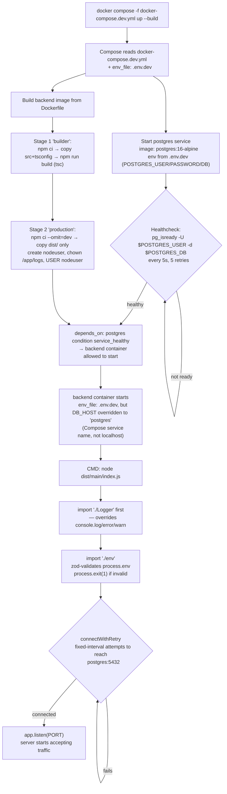

# `docker compose up` flow

Flow for `docker compose -f docker-compose.dev.yml up --build`. The base (`docker-compose.yml`) and
prod (`docker-compose.prod.yml`) files follow the same shape — they just differ in which `.env.*` file
is loaded and whether Postgres's port is published to the host.

## Key points

- The **image build** (left branch) and **Postgres startup + healthcheck** (right branch) happen in
  parallel — Compose doesn't serialize them.
- `backend` is gated on Postgres's healthcheck via `depends_on: condition: service_healthy`, not just
  container-start.
- Even though `.env.dev` may say something else, `docker-compose.dev.yml` hardcodes `DB_HOST: postgres`
  for the `backend` service — that's the Compose network hostname, not what a developer would use running
  the app directly with `npm run dev`.
- Inside the container there's a second wait loop (`connectWithRetry` in `main/index.ts`) — so the app
  doesn't start serving until it can actually open a DB connection, on top of Docker's own healthcheck
  gate.
